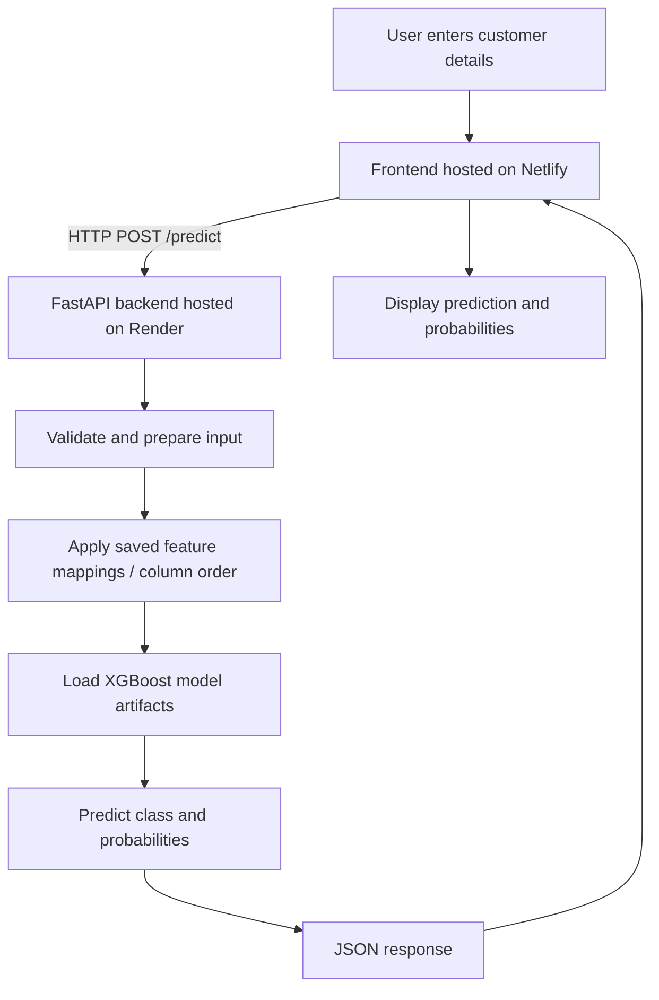

# Credit Risk Prediction System

A machine-learning web application that serves an XGBoost classification model through a FastAPI backend and a browser-based frontend. The project is deployed with Netlify (frontend) and Render (API backend).

## Live Demo

- **Frontend:** https://credit-risk-ml.netlify.app/
- **API / Swagger docs:** https://credit-risk-ml-api-u4ky.onrender.com/docs
- **Backend base URL:** https://credit-risk-ml-api-u4ky.onrender.com
- **GitHub repository:** https://github.com/rohitwankar88/credit-risk-ml-api

> **Important:** The model returns the classes `P1`, `P2`, `P3`, and `P4`. Do not describe these as specific risk levels (for example, low/high risk) until the original dataset documentation or model specification confirms their meaning.

## Project Overview

The application accepts customer-related input fields, applies the preprocessing expected by the trained model, and returns a predicted class with class probabilities. The API response includes a status, prediction, risk-category field, and probability values for the four model classes.

## Architecture



## Technology Stack

- **Machine learning:** XGBoost
- **API:** Python, FastAPI
- **Model serving:** Uvicorn (ASGI server)
- **Frontend:** HTML/CSS/JavaScript (see `index.html` and `frontend/`)
- **Deployment:** Render for backend, Netlify for frontend
- **Version control:** Git and GitHub
- **Saved artifacts:** Pickle (`.pkl`) files for model and preprocessing metadata

## Repository Structure

```text
credit-risk-ml-api/
├── app.py
├── requirements.txt
├── index.html
├── frontend/
├── netlify.toml
├── xgb_model.pkl
├── label_encoder.pkl
├── feature_columns.pkl
├── selected_features.pkl
├── education_mapping.pkl
└── README.md
```

The repository may contain additional files. Keep this tree aligned with the actual repository when updating it.

## API

### `GET /`

Use the root endpoint to check the API information.

### `GET /health`

Use the health endpoint to check whether the API and model are loaded, if this route is enabled in the deployed version.

### `POST /predict`

Submits customer inputs and returns a predicted class and class probabilities.

Example response shape (illustrative; values are examples, not a model-quality claim):

```json
{
  "status": "success",
  "prediction": "P1",
  "risk_category": "P1",
  "probabilities": {
    "P1": 0.8368,
    "P2": 0.0973,
    "P3": 0.0358,
    "P4": 0.0301
  }
}
```

Open the live Swagger documentation for the exact request schema and available endpoints:
https://credit-risk-ml-api-u4ky.onrender.com/docs

## Run Locally

1. Clone the repository:
   ```bash
   git clone https://github.com/rohitwankar88/credit-risk-ml-api.git
   cd credit-risk-ml-api
   ```
2. Create and activate a virtual environment:
   ```bash
   python -m venv .venv
   ```
   Windows:
   ```powershell
   .venv\Scripts\activate
   ```
   macOS/Linux:
   ```bash
   source .venv/bin/activate
   ```
3. Install dependencies:
   ```bash
   pip install -r requirements.txt
   ```
4. Start the API:
   ```bash
   uvicorn app:app --reload
   ```
5. Open:
   - API root: http://127.0.0.1:8000/
   - Swagger UI: http://127.0.0.1:8000/docs

The model artifact files must be present at the paths expected by `app.py`.

## Deployment Summary

- **Backend:** Deploy the FastAPI application on Render. Set the start command to the one configured for the project (commonly `uvicorn app:app --host 0.0.0.0 --port $PORT`).
- **Frontend:** Deploy the frontend directory or configured publish directory on Netlify. Check `netlify.toml` for project-specific settings.
- **CORS:** Ensure the backend permits requests from the deployed frontend origin.
- **Environment variables:** Keep secrets and credentials out of source control.

## Validation Checklist

- [ ] Verify all frontend inputs map to the expected API request fields.
- [ ] Verify raw inputs are transformed into the model's expected feature columns in the correct order.
- [ ] Test several profiles through both the frontend and `/predict`, using exactly identical inputs.
- [ ] Confirm probability values sum to approximately 1 (small differences may occur due to rounding).
- [ ] Evaluate the model on a held-out test set and record accuracy, precision, recall, F1-score, and a confusion matrix.
- [ ] Confirm the documented meaning of `P1`–`P4` from authoritative project/data documentation.
- [ ] Add genuine screenshots to the `screenshots/` directory and embed them below.

## Screenshots

## Screenshots

### Frontend
.png)

### Prediction Result
.png)

### API / Project View
.png)
<!--
### Frontend


### Prediction result


### Swagger API


### Deployment

-->

See [`SCREENSHOT_CHECKLIST.md`](SCREENSHOT_CHECKLIST.md) for the capture checklist.

## Limitations and Responsible Use

- This is a portfolio/demo project and should not be used as the sole basis for real lending, credit approval, or other high-impact decisions.
- Predictions depend on the training data, feature preparation, and model validation.
- The class labels `P1`–`P4` have not been assigned descriptive risk meanings in this README because that mapping needs authoritative confirmation.
- Do not upload real customer personal or financial data to a public demo.

## Author

**Rohit Wankar**  
GitHub: https://github.com/rohitwankar88

---

*Keep performance metrics, risk-label meanings, and feature counts in this README only after verifying them against the training/evaluation code and the deployed API schema.*
